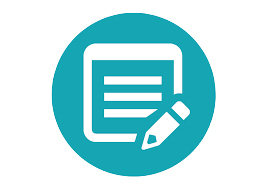

<!-- PROJECT LOGO -->
<br />
<p align="center">
  <a href="github.com/Olivier_Luethy/TackPad.git">
    
  </a>

  <h3 align="center">TackPad</h3>
  <h4 align="center">A notes application built with PHP and MVC</h4>

  <p align="center">
    Here I'll explain how I developed the note-taking application called TackPad.
    <br />
    <a href="github.com/Olivier_Luethy/TackPad.git/README.md"><strong>Explore the docs »</strong></a>
    <br />
    <br />
    <a href="github.com/Olivier_Luethy/TackPad.git">View Demo</a>
    ·
    <a href="github.com/Olivier_Luethy/TackPad.git/issues">Report Bug</a>
    ·
    <a href="github.com/Olivier_Luethy/TackPad.git/issues">Request Feature</a>
  </p>
</p>

<!-- TABLE OF CONTENTS -->
<details open="open">
  <summary>Table of Contents</summary>
  <ol>
    <li>
      <a href="#about-the-project">About The Project</a>
    </li>
    <li>
      <a href="#installation-guide">Installation Guide</a>
    </li>
  </ol>
</details>

<!-- ABOUT THE PROJECT -->

## About The Project

I always wanted to make a notes app, but for a long time I had trouble figuring out how to make something like that. Once I took a course and maybe it changed my whole coding experience, but I don't know.

After the course I started to build the notes application. But first I thought about what the application should know or what kind of skills it should have.
When I finalized each kind of use case, I finally started coding. It went pretty fast and wasn't as difficult as I expected.

But when I finished coding the project and put everything on github, I started thinking more and more about how I could make the application better. So I decided to add a login system so that everyone can create an account and see only their own notes and not anything from other people.

Let's see what the project will do in the future😁.
But one thing I can say is that I was able to do everything I planned before I started coding!

<!-- INSTALLATION -->

## Installation Guide

1. First you need to install git on your local machine. To do this, go to this [website] (https://git-scm.com/downloads).
2. Go to your windows explorer and find a good place to store this project.
3. Now right click on your folder or location and click on "Git Bash Here".
4. Finally you will see something that looks like a windows command prompt. When it does, all you have to do is type
   ```sh
   git clone http://192.168.100.57:3000/Olivier_Luethy/TackPad.git
   ```
5. Once you have successfully cloned the project, you will need a local database. I used [XAMPP](https://www.apachefriends.org/de/index.html). If you want to use it too, please make sure you download the latest version. Otherwise it won't work as expected.
